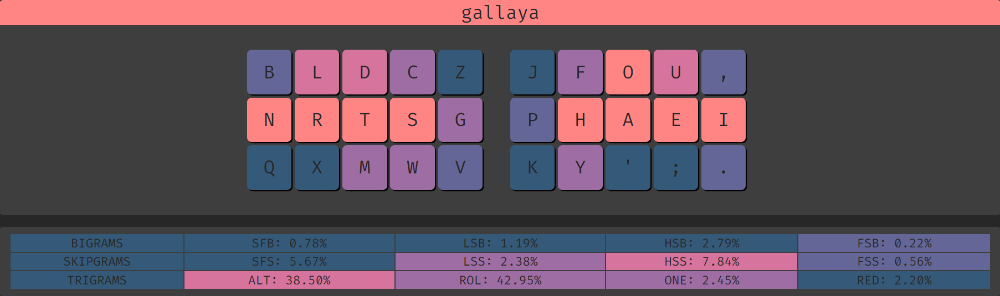
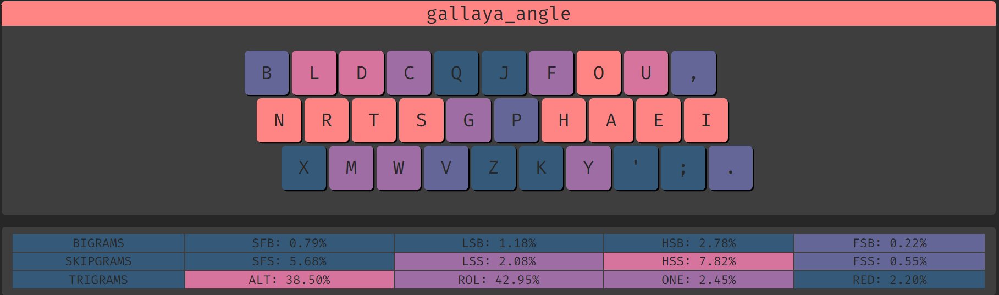
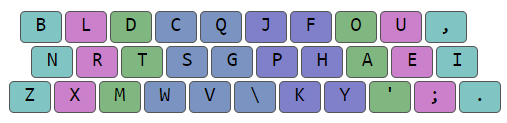

# Gallaya

Essentially an amalgamation and portmanteau of layouts [Gallium](https://github.com/GalileoBlues/Gallium) and Maya.

Whilst Gallium and Maya don't have as low a Single Finger Bigrams (SFB) percentage as SFB optimised layouts such as ISRT, whorf, or sind, what metrics they do better in are Disjointed Single Finger Bigrams (DSFB), also known as Single Finger Skipgrams (SFS), and Lateral Stretch Bigrams (LSB). Personally, as much as I like a low SFB percentage, I'd take a hit on SFBs if it meant other equally negatively preceived metrics were improved; resulting in a more balanced layout.

Gallaya takes the left hand of Gallium[^1] and the right hand of Maya[^1], working the remaining letters in the centre columns to balance metrics using ClemenPine's [keysolve-Web](https://clemenpine.github.io/keysolve-web/) tool.   
[^1]: Excludes centre columns.

*P.S. To save those curious the time, Mayium (Left hand Maya, Right hand Gallium, tweaking in the middle) doesn't statistically fair better than either of its parent layouts* 

Angle modded, Z would've remained in left first finger centre column position with Q in the "worst position" had angle mod been strictly adhered too. As Z is the least used character in English, it's position was swapped with Q.

Also included Angle Mod for ISO form factors, as a homage to Colemak-DH and for fellow UK English users.

**Matrix:**  
  

**Angle Mod for ANSI form factor:**  
  

**Angle Mod for ISO form factor:**   
  
*UK English*
